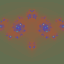
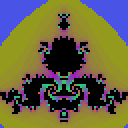
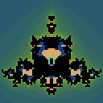
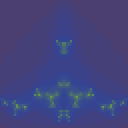

# Fracticons 🌀

Generate unique, deterministic fractal avatars from any string. Beautiful, fast, and dependency-free.

[](https://www.npmjs.com/package/fracticons)
[](https://github.com/bobbyquantum/fracticons/actions/workflows/ci.yml)
[](https://opensource.org/licenses/MIT)

<p align="center">
  
  
  
  
  
</p>

<p align="center">
  <a href="https://bobbyquantum.github.io/fracticons/">📚 Documentation</a> •
  <a href="https://bobbyquantum.github.io/fracticons/demo">🎮 Live Demo</a>
</p>

## ✨ Features

- 🎨 **Beautiful fractals** - Julia sets with 10 curated color palettes
- 🔒 **Deterministic** - Same input always produces same output
- ⚡ **Fast** - ~3ms per 128px avatar
- 📦 **Zero dependencies** - Custom PNG encoder included
- 🖼️ **PNG output** - Compact, universal format
- 🔄 **Symmetric** - Horizontally mirrored for visual appeal
- 🎛️ **Configurable** - Size, shape, colors, fractal type

## 📦 Installation

```bash
npm install fracticons
```

## 🚀 Quick Start

```typescript
import { generateFracticonDataURL } from 'fracticons';

// Generate a data URL for an avatar
const avatarUrl = generateFracticonDataURL('user@example.com');

// Use in HTML
document.querySelector('img').src = avatarUrl;
```

### Node.js (save to file)

```typescript
import { generateFracticon } from 'fracticons';
import { writeFileSync } from 'fs';

const pngBuffer = generateFracticon('my-unique-id');
writeFileSync('avatar.png', pngBuffer);
```

## 🎨 Color Palettes

Choose from 10 beautiful color palettes:

```typescript
import { generateFracticonDataURL } from 'fracticons';

// Available palettes: random, fire, ocean, forest, sunset, neon, pastel, monochrome, grayscale, rainbow
const avatar = generateFracticonDataURL('user@example.com', {
  paletteStyle: 'ocean'
});
```

| Palette | Description |
|---------|-------------|
| `random` | Procedurally generated (default) |
| `fire` | Warm reds, oranges, yellows |
| `ocean` | Cool blues and teals |
| `forest` | Natural greens and browns |
| `sunset` | Purple, orange, pink gradients |
| `neon` | Vibrant, high-contrast colors |
| `pastel` | Soft, muted tones |
| `monochrome` | Single color variations |
| `grayscale` | Black and white |
| `rainbow` | Full spectrum |

## ⚙️ Options

```typescript
interface FracticonOptions {
  size?: number;           // Output size in pixels (default: 128)
  resolution?: number;     // Fractal resolution (default: 64)
  circular?: boolean;      // Circular mask (default: false)
  fractalType?: 'julia' | 'mandelbrot' | 'burning-ship' | 'tricorn';
  preset?: string;         // Julia preset name
  c?: { real: number; imag: number };  // Custom Julia c value
  paletteStyle?: PaletteStyle;     // Color palette
}
```

### Examples

```typescript
// Large circular avatar
generateFracticonDataURL('user123', {
  size: 256,
  circular: true
});

// Specific fractal type
generateFracticonDataURL('user123', {
  fractalType: 'mandelbrot'
});

// Neon color scheme
generateFracticonDataURL('user123', {
  paletteStyle: 'neon'
});
```

## 🔧 API

### `generateFracticon(input: string, options?: FracticonOptions): Buffer`

Generates a PNG buffer from the input string.

### `generateFracticonDataURL(input: string, options?: FracticonOptions): string`

Generates a base64 data URL suitable for `` src attributes.

### `generateFracticonWithMetadata(input: string, options?: FracticonOptions)`

Returns both the PNG buffer and metadata about the generated fractal:

```typescript
const { png, metadata } = generateFracticonWithMetadata('user@example.com');

console.log(metadata);
// {
//   fractalType: 'julia',
//   c: { real: -0.8, imag: 0.156 },
//   palette: [...],
// }
```

## 🎯 Julia Presets

The library includes 10 curated Julia set presets for consistently beautiful results:

- `galaxy` - Spiral galaxy patterns
- `lightning` - Electric, branching forms
- `seahorse` - Classic seahorse valley
- `spiral` - Tight spiral structures
- `dendrite` - Tree-like branching
- `rabbit` - Douady's rabbit
- `dragon` - Dragon curve patterns
- `starfish` - Star-shaped patterns
- `snowflake` - Crystalline structures
- `explosion` - Radial burst patterns

By default, the library picks a random preset and applies slight perturbation for variety while maintaining quality.

## 🔬 How It Works

1. **Hash** - Input string is hashed using SHA-256
2. **Seed** - Hash seeds a deterministic PRNG (xorshift128+)
3. **Parameters** - PRNG selects fractal parameters near known-good presets
4. **Render** - Fractal is rendered and horizontally mirrored
5. **Encode** - Custom PNG encoder outputs compressed image

### Quality Filtering

The library automatically rejects "boring" fractals:
- More than 25% black pixels → regenerate
- Fewer than 8 unique iteration values → regenerate
- Up to 10 attempts before falling back

## 📊 Performance

| Size | Time |
|------|------|
| 64px | ~1ms |
| 128px | ~3ms |
| 256px | ~10ms |
| 512px | ~35ms |

## 🌐 Browser Support

Works in all modern browsers. The PNG encoder uses `TextEncoder` for compression.

```html
<script type="module">
  import { generateFracticonDataURL } from 'https://unpkg.com/fracticons';
  
  document.getElementById('avatar').src = generateFracticonDataURL('hello@world.com');
</script>
```

## 📄 License

MIT © bobbyquantum

## 🤝 Contributing

Contributions welcome! Please open an issue or pull request.

---

<p align="center">
  Made with 🌀 by the Fracticons team
</p>
