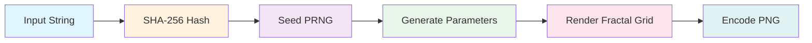

# How It Works

This page explains the complete algorithm that transforms any input string into a unique fractal avatar.

## Overview

The Fracticons pipeline has five main stages:



Each stage is deterministic, meaning the same input always produces the exact same output.

---

## Input Formats

Fracticons accepts three input formats:

### 1. String Input (Simple)

Best for most use cases. Pass any string and it gets hashed automatically.

```typescript
import { generateFracticonDataURL } from 'fracticons';

// String is hashed with SHA-256 internally
const avatar = generateFracticonDataURL('user@example.com');
```

**Functions:** `generateFracticon()`, `generateFracticonDataURL()`, `generateFracticonWithMetadata()`

### 2. Hex Hash Input (Pre-computed)

Use when you already have a hash string (e.g., from a database or external system).

```typescript
import { generateFracticonFromHex, sha256 } from 'fracticons';

// Compute hash once
const hash = sha256('user@example.com');

// Reuse for multiple sizes
const small = generateFracticonFromHex(hash, { size: 32 });
const large = generateFracticonFromHex(hash, { size: 256 });
```

**Functions:** `generateFracticonFromHex()`, `generateFracticonDataURLFromHex()`, `generateFracticonFromHexWithMetadata()`

### 3. Binary Input (Maximum Performance)

Use when you have raw hash bytes (e.g., from Web Crypto API or Node.js crypto).

```typescript
import { generateFracticonFromBytes } from 'fracticons';

// Using Web Crypto API
const data = new TextEncoder().encode('user@example.com');
const hashBuffer = await crypto.subtle.digest('SHA-256', data);
const avatar = generateFracticonFromBytes(new Uint8Array(hashBuffer));
```

**Functions:** `generateFracticonFromBytes()`, `generateFracticonDataURLFromBytes()`, `generateFracticonFromBytesWithMetadata()`

---

## Stage 1: Hashing

The input string (email, username, ID, etc.) is converted to a 256-bit hash using **SHA-256**.

### Why SHA-256?

- **Industry standard** — The same algorithm used by Gravatar, Bitcoin, TLS, and countless other systems
- **Collision resistant** — Probability of two different inputs producing the same hash is approximately 1 in 2^128 (astronomically unlikely)
- **Well-distributed** — Output bits are uniformly random
- **Deterministic** — Same input always produces the same output

### Collision Resistance in Practice

SHA-256 produces a 256-bit (32-byte) hash. For avatar generation, we use all 256 bits to seed our random number generator, which means:

- **2^256 possible hashes** — More than the number of atoms in the observable universe
- **Birthday paradox threshold** — You'd need roughly 2^128 inputs before a 50% chance of collision
- **For practical purposes** — Even with billions of users, collisions are effectively impossible

This is the same level of security used by:
- Gravatar (for avatar lookups)
- Git (for commit identification)
- HTTPS certificates

### Implementation

We include a pure JavaScript SHA-256 implementation for zero dependencies, but it produces identical output to Node.js `crypto.createHash('sha256')` or the Web Crypto API.

```typescript
import { sha256 } from 'fracticons';

const hash = sha256('user@example.com');
// → '84059b07d4be67b806386c0aad8070a23f18836bbaae342275dc0a83414c32ee'
```

### Hash Detection

When you pass a string to Fracticons, it automatically detects whether it's already a hash:

- If the input is 16+ hexadecimal characters → used directly as the hash
- Otherwise → hashed with SHA-256 first

This means you can pass either raw strings or pre-computed hashes:

```typescript
// Both produce identical avatars:
generateFracticonDataURL('user@example.com');
generateFracticonDataURL('84059b07d4be67b806386c0aad8070a23f18836bbaae342275dc0a83414c32ee');
```

---

## Stage 2: Seeded Random Number Generation

The hash values seed a **xorshift128+** pseudo-random number generator (PRNG).

### Why xorshift128+?

- **High quality** — Passes statistical randomness tests
- **Fast** — Only bitwise operations
- **Deterministic** — Same seeds always produce the same sequence
- **Long period** — 2^128 - 1 values before repeating

### Implementation

```typescript
class SeededRandom {
  private state: [number, number, number, number];

  constructor(seeds: number[]) {
    // Initialize 128-bit state from seeds
    this.state = [seeds[0], seeds[1], seeds[2], seeds[3]];
  }

  next(): number {
    // xorshift128+ algorithm
    let s1 = this.state[0];
    const s0 = this.state[1];
    this.state[0] = s0;
    s1 ^= s1 << 23;
    s1 ^= s1 >>> 17;
    s1 ^= s0;
    s1 ^= s0 >>> 26;
    this.state[1] = s1;
    return (s0 + s1) >>> 0;
  }

  // Returns a float in [0, 1)
  random(): number {
    return this.next() / 0x100000000;
  }
}
```

---

## Stage 3: Parameter Generation

The PRNG generates all parameters needed for the fractal:

### 3.1 Fractal Type Selection

By default, Julia sets are used because they offer the best visual variety. The type can also be explicitly specified.

### 3.2 Julia Set c Value (The "Nearby Interesting" Strategy)

This is the most important parameter. The complex constant `c` determines the entire structure of a Julia set.

**The Problem:** Most random `c` values produce boring results — either mostly black (points escape too quickly) or mostly uniform (points never escape).

**The Solution:** We maintain a curated list of 10 "interesting" preset values known to produce beautiful fractals:

| Preset | c value | Visual style |
|--------|---------|--------------|
| galaxy | -0.8 + 0.156i | Spiral galaxies |
| lightning | -0.1 + 0.651i | Branching electric patterns |
| seahorse | -0.74543 + 0.11301i | Classic seahorse valley |
| spiral | -0.75 + 0.11i | Tight spirals |
| dendrite | 0.0 + 1.0i | Tree-like branching |
| rabbit | -0.123 + 0.745i | Douady's rabbit |
| dragon | -0.8 + 0.0i | Dragon curve patterns |
| starfish | -0.4 + 0.6i | Star shapes |
| snowflake | 0.285 + 0.01i | Crystalline structures |
| explosion | -0.7269 + 0.1889i | Radial bursts |

**The Algorithm:**

1. Randomly pick one of the 10 presets
2. Add small random perturbation (±0.08) to both real and imaginary parts
3. This ensures variety while staying in "interesting" regions of the parameter space

```typescript
function generateCandidateParams(rng: SeededRandom): { real: number; imag: number } {
  const presetNames = Object.keys(JULIA_PRESETS);
  const presetIndex = Math.floor(rng.random() * presetNames.length);
  const preset = JULIA_PRESETS[presetNames[presetIndex]];
  
  // Perturbation range
  const perturbRange = 0.08;
  const realPerturbation = (rng.random() - 0.5) * 2 * perturbRange;
  const imagPerturbation = (rng.random() - 0.5) * 2 * perturbRange;
  
  return {
    real: preset.real + realPerturbation,
    imag: preset.imag + imagPerturbation,
  };
}
```

### 3.3 Color Palette Generation

Colors are generated based on the selected palette style:

- **Random:** Picks a base hue and generates harmonious variations
- **Themed:** Uses predefined color ranges (fire = reds/oranges, ocean = blues/teals, etc.)

Each palette consists of multiple colors that are interpolated based on iteration count.

---

## Stage 4: Fractal Grid Generation

The fractal is rendered into a 2D grid of iteration values.

### 4.1 The Julia Set Algorithm

For each pixel (x, y) in the grid:

1. Map pixel coordinates to complex plane coordinates
2. Iterate the function z = z² + c
3. Count iterations until |z| > 2 (escape) or max iterations reached
4. Store the iteration count

```typescript
function juliaIteration(
  zReal: number, 
  zImag: number, 
  cReal: number, 
  cImag: number, 
  maxIter: number
): number {
  let zr = zReal;
  let zi = zImag;
  
  for (let i = 0; i < maxIter; i++) {
    const zr2 = zr * zr;
    const zi2 = zi * zi;
    
    // Check escape condition: |z|² > 4
    if (zr2 + zi2 > 4) {
      return i;
    }
    
    // z = z² + c
    zi = 2 * zr * zi + cImag;
    zr = zr2 - zi2 + cReal;
  }
  
  return maxIter; // Point is in the set
}
```

### 4.2 Coordinate Mapping

The grid is mapped to a region of the complex plane:

```typescript
// Map pixel (x, y) to complex coordinates
const scale = 3.0 / resolution; // View window size
const real = (x - resolution / 2) * scale;
const imag = (y - resolution / 2) * scale;
```

### 4.3 Horizontal Symmetry

To create more visually balanced avatars, only the left half is computed, then mirrored horizontally:

```typescript
for (let y = 0; y < resolution; y++) {
  for (let x = 0; x < halfWidth; x++) {
    const iterations = juliaIteration(real, imag, c.real, c.imag, maxIter);
    grid[y][x] = iterations;
    grid[y][resolution - 1 - x] = iterations; // Mirror
  }
}
```

### 4.4 Quality Filtering (Entropy Check)

After generation, the grid is checked for visual interest:

1. **Black pixel ratio:** If more than 25% of pixels are "in the set" (black), regenerate
2. **Unique values:** If fewer than 8 unique iteration values exist, regenerate
3. **Max attempts:** Try up to 10 different c values before accepting

This ensures avatars are never boring or mostly empty.

---

## Stage 5: PNG Rendering

The iteration grid is converted to a PNG image.

### 5.1 Color Mapping

Each iteration value is mapped to a color:

```typescript
function getColorForIteration(
  iteration: number, 
  maxIter: number, 
  palette: Color[]
): RGB {
  if (iteration === maxIter) {
    return { r: 0, g: 0, b: 0 }; // Points in set are black
  }
  
  // Normalize iteration to [0, 1]
  const t = iteration / maxIter;
  
  // Interpolate through palette
  const palettePos = t * (palette.length - 1);
  const index = Math.floor(palettePos);
  const frac = palettePos - index;
  
  // Linear interpolation between adjacent colors
  return lerp(palette[index], palette[index + 1], frac);
}
```

### 5.2 Upscaling

The fractal grid (default 64×64) is upscaled to the output size (default 128×128) using nearest-neighbor interpolation for crisp edges.

### 5.3 Circular Mask (Optional)

If `circular: true`, pixels outside the inscribed circle are made transparent.

### 5.4 PNG Encoding

The pixel data is encoded to PNG format using a custom encoder:

1. **Raw pixel data** — RGBA values for each pixel
2. **Filtering** — PNG filter type 0 (None) for simplicity
3. **Compression** — DEFLATE compression using the browser's CompressionStream API
4. **Chunks** — IHDR (header), IDAT (compressed data), IEND (end marker)

This custom PNG encoder has zero dependencies and works in both browsers and Node.js.

---

## Complete Pipeline Example

```typescript
// Input: "user@example.com"

// Stage 1: Hash
// → [2837492847, 1928374655, 3847562910, 1029384756]

// Stage 2: Seed PRNG
// → SeededRandom initialized with 128-bit state

// Stage 3: Generate Parameters
// → Picked preset: "seahorse" (-0.74543 + 0.11301i)
// → Added perturbation: (-0.72103 + 0.09847i)
// → Palette: "random" → [#2A1B5C, #6B3FA0, #C490D1, #F4D35E]

// Stage 4: Generate Grid
// → 64×64 grid of iteration values (0-255)
// → Passed entropy check (18% black, 47 unique values)
// → Horizontally mirrored

// Stage 5: Render PNG
// → Upscaled to 128×128
// → Applied color palette
// → Compressed with DEFLATE
// → Output: ~2-4KB PNG file
```

---

## Performance Characteristics

| Stage | Time (128px) | Notes |
|-------|--------------|-------|
| Hashing | ~0.01ms | Simple string operations |
| PRNG setup | ~0.01ms | Array initialization |
| Parameter gen | ~0.1ms | Random number generation |
| Fractal grid | ~1-2ms | Main computation (64×64 iterations) |
| PNG encoding | ~1-2ms | Compression dominates |
| **Total** | **~3ms** | Varies by CPU and input |

---

## Other Fractal Types

While Julia sets are the default, Fracticons supports other fractal algorithms:

### Mandelbrot Set

Instead of fixing `c` and varying the initial `z`, the Mandelbrot set fixes the initial value at `z = 0` and varies `c` for each pixel:

```typescript
// Initial z = 0, c = pixel coordinate
// Iterate: z = z² + c
```

### Burning Ship

Uses absolute values, creating asymmetric "burning ship" shapes:

```typescript
// z = (|Re(z)| + i|Im(z)|)² + c
zr = Math.abs(zr);
zi = Math.abs(zi);
```

### Tricorn (Mandelbar)

Uses complex conjugate, creating three-fold symmetry:

```typescript
// z = conj(z)² + c
zi = -zi; // Conjugate before squaring
```

---

## Further Reading

- [Julia Sets on Wikipedia](https://en.wikipedia.org/wiki/Julia_set)
- [The Mandelbrot Set](https://en.wikipedia.org/wiki/Mandelbrot_set)
- [SHA-256 on Wikipedia](https://en.wikipedia.org/wiki/SHA-2)
- [xorshift PRNGs](https://en.wikipedia.org/wiki/Xorshift)
